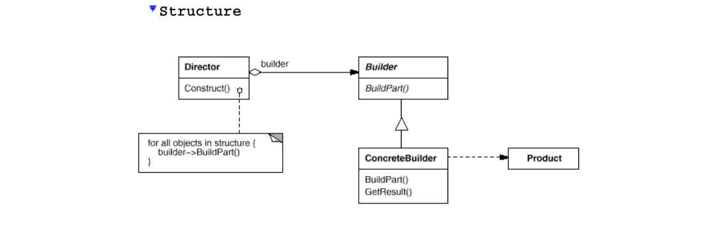

# Builder
## Structure

## Intent

Separate the construction of a complex object from its representation so that
the same construction process can create different representations.

## Applicability

1. Independence from Object Composition:

    - Use this pattern when creating a complex object should be separate from the parts and their assembly.

    - Example: Building a house where the design and materials are independent of the construction process.

1. Supporting Multiple Representations:

    - Use this pattern when the construction process should support different representations of the constructed object.

    - Example: Building different types of houses (e.g., villas, apartments) using the same construction process.