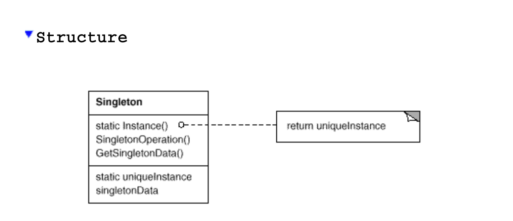

# Singleton
## Structure

## Intent

Ensure a class only has one instance, and provide a global point of access to
it.

## Applicability

1. Ensuring a Single Instance:

    - Use this pattern when there must be exactly one instance of a class, and it must be accessible to clients from a well-known access point.

    - Example: A logging class where only one log file should be used throughout the application.

2. Extending the Sole Instance:

    - Use this pattern when the sole instance should be extensible by subclassing, and clients should be able to use an extended instance without modifying their code.

    - Example: A configuration manager class that might be extended for different environments (e.g., development, production) while keeping client code unchanged.