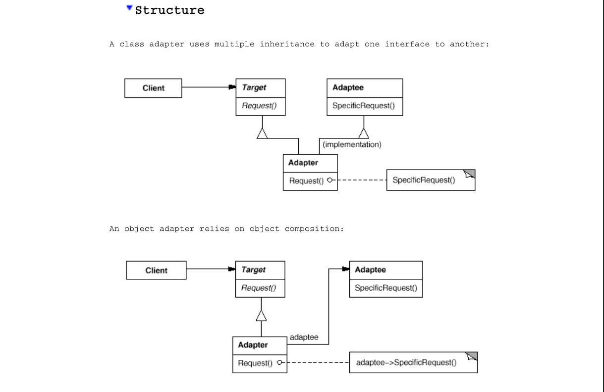

# Builder
## Structure

## Intent

Convert the interface of a class into another interface clients expect. Adapter
lets classes work together that couldn't otherwise because of incompatible
interfaces.

## Applicability

1. **Adapting Incompatible Interfaces:**

    - Use this pattern when you want to use an existing class, but its interface does not match the one you need.
    
    - Example: Integrating a legacy system's functionality into a new application without modifying the legacy code.

2. **Creating Reusable Classes:**

    - Use this pattern when you want to create a reusable class that can work with unrelated or unforeseen classes that don't necessarily have compatible interfaces.
    
    - Example: Designing a class that can be easily adapted to interact with different APIs, regardless of their interface differences.

3. **Handling Multiple Subclasses (Object Adapter Only):**

    - Use this pattern when you need to work with several existing subclasses, but it's impractical to adapt their interface by subclassing each one individually. An object adapter can adapt the interface of its parent class.
    
    - Example: Adapting a family of classes with a shared parent class to work with a new system by creating a single adapter, rather than modifying each subclass.
