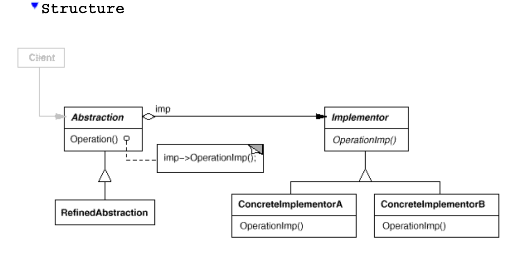

# Bridge

## Alias

Handle/Body

## Structure

## Intent

Decouple an abstraction from its implementation so that the two can vary
independently.

## Applicability

1. **Avoiding Permanent Binding Between Abstraction and Implementation:**

   - Use this pattern when you want to avoid a permanent binding between an abstraction and its implementation. This might be necessary when the implementation must be selected or switched at run-time.

   - Example: Designing a system where the implementation of a feature can be changed dynamically without affecting the client code.

2. **Extensibility by Subclassing:**

   - Use this pattern when both the abstractions and their implementations need to be extensible through subclassing. The Bridge pattern allows you to combine different abstractions and implementations and extend them independently.

   - Example: Creating a graphics system where different shapes (abstractions) can be drawn using different rendering engines (implementations).

3. **Isolating Implementation Changes from Clients:**

   - Use this pattern when changes in the implementation of an abstraction should have no impact on the clients. The client code should not need to be recompiled when the implementation changes.

   - Example: Developing a software library where implementation details can change without requiring changes to the client applications.

4. **Managing Class Proliferation:**

   - Use this pattern when you notice a proliferation of classes, which indicates the need to split an object into two parts. This situation often arises in complex class hierarchies, referred to as "nested generalizations."

   - Example: Refactoring a class hierarchy that has grown too large, by separating the abstraction from its implementation.

5. **Sharing Implementations Among Multiple Objects:**

   - Use this pattern when you want to share an implementation among multiple objects (e.g., using reference counting) and hide this fact from the client.

   - Example: Implementing a string class where multiple objects share the same string representation to save memory, without exposing this detail to the users of the class.
