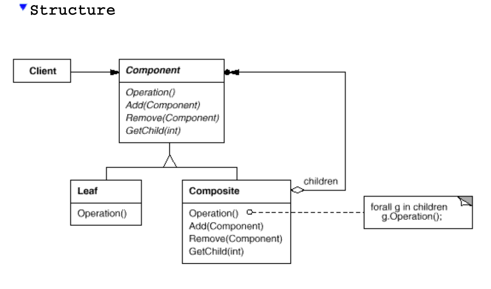

# Composite

## Structure

## Intent

Compose objects into tree structures to represent part-whole hierarchies.
Composite lets clients treat individual objects and compositions of objects
uniformly.

## Applicability

1. **Representing Part-Whole Hierarchies:**

   - Use this pattern when you want to represent part-whole hierarchies of objects. This pattern is ideal for situations where you need to treat both individual objects and compositions of objects in a uniform way.

   - Example: Designing a file system where both files and directories (which can contain files or other directories) need to be treated as part of a hierarchy.

2. **Uniform Treatment of Compositions and Individual Objects:**

   - Use this pattern when you want clients to be able to ignore the difference between compositions of objects and individual objects. Clients will interact with all objects in the composite structure uniformly, simplifying the client code.

   - Example: Building a graphic drawing application where shapes (such as lines, circles, and rectangles) and complex compositions of shapes are treated in the same way, allowing the same operations to be applied to both.